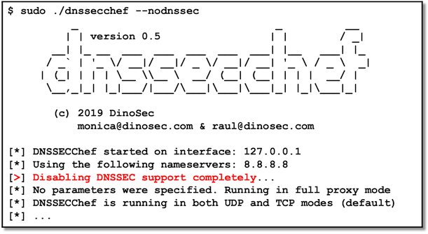

# dnssecchef
> DNSSECChef: DNS/DNSSEC Interception Proxy.

DNSSECChef is a highly configurable DNS and DNSSEC interception proxy for penetration 
testers and security researchers (based on DNSChef).



## Prerequisites

**macOS & Linux:**

Python 2.7.x, plus:
```
pip install IPy
pip install dnslib
```

DNSSECChef v0.5 requires dnslib v0.9.10+ available at 
[PyPI](https://pypi.org/project/dnslib/), 
[bitbucket](https://bitbucket.org/paulc/dnslib/) or
[GitHub](https://github.com/paulchakravarti/dnslib).

## Setting up a DNS Proxy

It is possible to manually and explicitly configure a DNS proxy for differente operating systems, 
as detailed in the original DNSChef documentation available in the 
[DNSChef.documentation.md](DNSChef.documentation.md) file. 

Additionally, it is possible to configure a transparent DNS proxy in Linux using the ``iptables``
NAT capabilities, using a set of rules such as the following ones (where ``eth1`` is
the network interface connecting to the Internet):
```
$ sudo iptables -t nat -A POSTROUTING -o eth1 -j MASQUERADE

$ sudo iptables -t nat -A PREROUTING -p udp --destination-port 53 -j REDIRECT --to-port 53
$ sudo iptables -t nat -A PREROUTING -p tcp --destination-port 53 -j REDIRECT --to-port 53
```

## Usage examples

Default usage, DNS proxy with no DNSSEC specific manipulation:
```
$ sudo ./dnssecchef.py [--file dnssecchef.ini]
```

Enable DNSSEC flags manipulation in both DNS queries and responses:
```
$ sudo ./dnssecchef.py --dnssec [--file dnssecchef.ini]
```

Completely remove support for DNSSEC, forcing plain usage of DNS:
```
$ sudo ./dnssecchef.py --nodnssec [--file dnssecchef.ini]
```

_For more examples and usage details, including all the capabilities previously available in 
DNSChef, please refer to the original DNSChef documentation available in the 
[DNSChef.documentation.md](DNSChef.documentation.md) file._

## Example configuration file

See [dnssecchef.ini](dnssecchef.ini) for an example configuration file.

## Release History

* 0.5
    * First public version (released during the X Anniversary at [RootedCON 2019](https://www.rootedcon.com)).

## Authors

* **Monica Salas and Raul Siles** - (c) 2019 [DinoSec](https://www.dinosec.com)

DNSSECChef is based on the highly customizable [dnschef](https://github.com/iphelix/dnschef), 
version 0.3, by Peter Kacherginsky (iphelix), and it also uses the excellent 
[dnslib](https://bitbucket.org/paulc/dnslib/) library, version 0.9.10+, by Paul Chakravarti.

## License

Distributed under the BSD-3-Clause license (like the original DNSChef). See [LICENSE](LICENSE) for more information.
